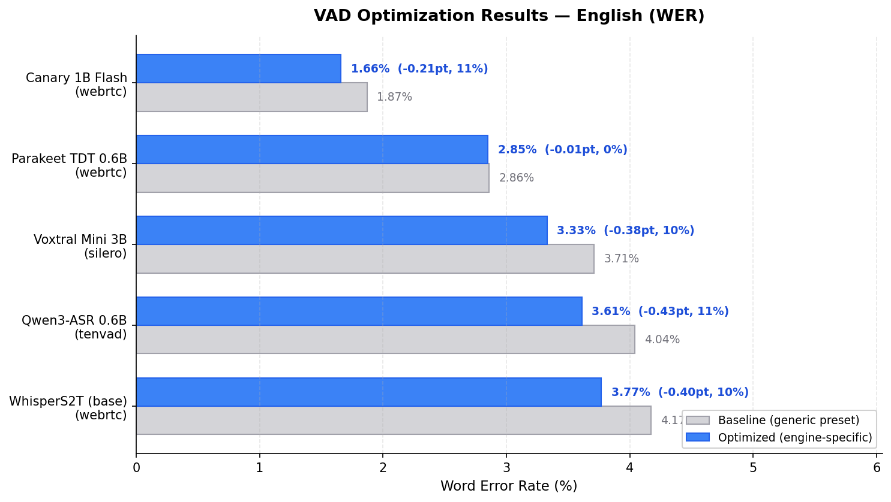
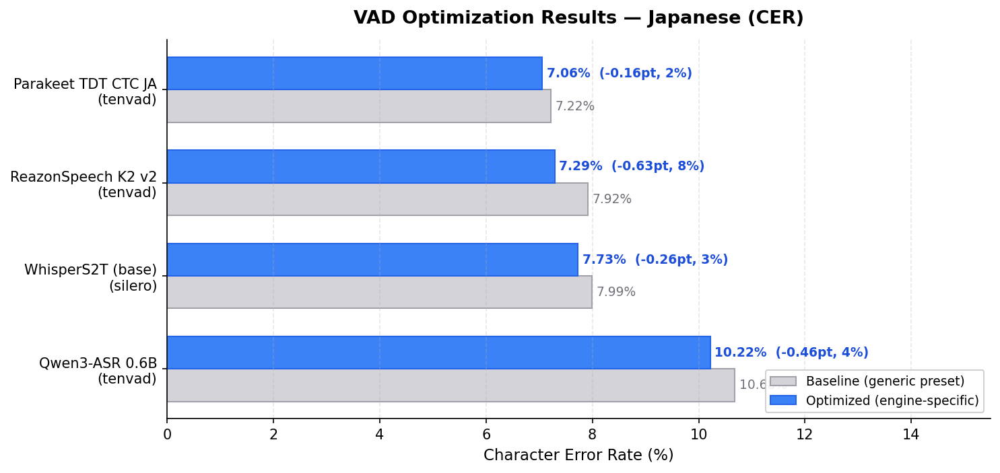

# LiveCap CLI

LiveCap CLI は高性能な音声文字起こしライブラリです。リアルタイム文字起こし、ファイル処理、複数の ASR エンジン対応を提供します。

## 主な機能

- **リアルタイム文字起こし** - VAD（音声活動検出）ベースのストリーミング処理
- **ファイル文字起こし** - 音声/動画ファイルから SRT 字幕生成
- **マルチエンジン対応** - Whisper, ReazonSpeech, Parakeet, Canary など
- **16言語サポート** - 日本語、英語、中国語、韓国語など
- **VAD パラメータ自動最適化** - エンジン×言語ごとに Bayesian 最適化済みの 27 プリセットを同梱

## クイックスタート

### インストール

```bash
git clone https://github.com/Mega-Gorilla/livecap-cli
cd livecap-cli

# uv を使用（推奨）
uv sync --extra engines-torch

# pip を使用
pip install -e ".[engines-torch]"
```

**注意**: Linux では TenVAD に libc++ が必要です：

```bash
# Ubuntu/Debian
sudo apt-get install libc++1
```

> 翻訳やその他の extra については [CLI リファレンス](docs/reference/cli.md) を参照してください。

### 基本的な使い方

```bash
# 診断情報表示
livecap-cli info

# ファイル文字起こし
livecap-cli transcribe input.mp4 -o output.srt

# リアルタイム文字起こし（マイク）
livecap-cli transcribe --realtime --mic 0 --engine whispers2t --device auto
```

詳細は [CLI リファレンス](docs/reference/cli.md) を参照してください。Python API については [API リファレンス](docs/reference/api.md) を参照してください。

## 対応エンジン

| ID | モデル | サイズ | 言語 |
|----|--------|--------|------|
| `reazonspeech` | ReazonSpeech K2 v2 | 159MB | ja |
| `whispers2t` | WhisperS2T | 可変 | 多言語 |
| `parakeet` | Parakeet TDT 0.6B | 1.2GB | en |
| `parakeet_ja` | Parakeet TDT CTC JA | 600MB | ja |
| `canary` | Canary 1B Flash | 1.5GB | en, de, fr, es |
| `voxtral` | Voxtral Mini 3B | 3GB | 多言語 |
| `qwen3asr` | Qwen3-ASR 0.6B | 1.2GB | 多言語(30+) |

> `whispers2t` は `--model-size` で `tiny`, `base`, `small`, `medium`, `large-v3`, `large-v3-turbo` を選択可能

## VAD 最適化ベンチマーク

各 ASR エンジン×言語の組み合わせに対して、Bayesian 最適化（Optuna TPE sampler, 100 trials）で VAD パラメータを自動チューニングした **27 プリセット**を同梱しています。`--vad auto` 使用時、エンジンと言語に応じて最適なプリセットが自動選択されます。

**全 27 組み合わせ中 26 件で汎用プリセット比改善**（最大改善: WER -2.36pt / 33.9%）

### English (WER: Word Error Rate)



| Engine | Best VAD | Baseline | Optimized | 改善率 |
|--------|----------|----------|-----------|--------|
| Canary 1B Flash | webrtc | 1.87% | **1.66%** | 11.2% |
| Parakeet TDT 0.6B | webrtc | 2.86% | **2.85%** | 0.3% |
| Voxtral Mini 3B | silero | 3.71% | **3.33%** | 10.2% |
| Qwen3-ASR 0.6B | tenvad | 4.04% | **3.61%** | 10.6% |
| WhisperS2T (base) | webrtc | 4.17% | **3.77%** | 9.6% |

### Japanese (CER: Character Error Rate)



| Engine | Best VAD | Baseline | Optimized | 改善率 |
|--------|----------|----------|-----------|--------|
| Parakeet TDT CTC JA | tenvad | 7.22% | **7.06%** | 2.2% |
| ReazonSpeech K2 v2 | tenvad | 7.92% | **7.29%** | 8.0% |
| WhisperS2T (base) | silero | 7.99% | **7.73%** | 3.3% |
| Qwen3-ASR 0.6B | tenvad | 10.68% | **10.22%** | 4.3% |

> Baseline = 汎用（parakeet/parakeet_ja）プリセットで実行した結果。Benchmark corpus: LibriSpeech test-clean (EN), JSUT basic5000 subset (JA)

## ドキュメント

- [CLI リファレンス](docs/reference/cli.md)
- [API リファレンス](docs/reference/api.md) - ライブラリとして使用する際の API ドキュメント
- [リアルタイム文字起こしガイド](docs/guides/realtime-transcription.md)
- [API 仕様書](docs/architecture/core-api-spec.md)
- [機能一覧](docs/reference/feature-inventory.md)
- [テストガイド](docs/testing/README.md)
- [サンプル README](examples/README.md)

## 必要環境

- Python 3.10 - 3.12
- Linux / macOS / Windows
- [uv](https://github.com/astral-sh/uv)（推奨）または pip

マイク入力を使用する場合は PortAudio が必要です：

```bash
# Ubuntu/Debian
sudo apt-get install libportaudio2

# macOS
brew install portaudio
```

## ライセンス

AGPL-3.0 - 詳細は [LICENSE](LICENSE) を参照

質問やコラボレーションは [LiveCap Discord](https://discord.gg/hdSV4hJR8Y) へ
